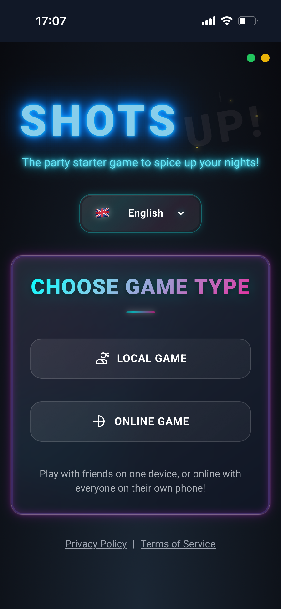

# 🥃 ShotsUp! – The Ultimate Party Game


🌐 Live demo: https://partyraspi.vmmozi.org/

## 📌 About the Project

**ShotsUp!** is a modern, interactive web-based party game designed to make house parties and social gatherings more fun and engaging.  
The game supports both **Local mode** (single device, pass-the-phone) and **Online Multiplayer mode** (real-time synchronized gameplay across multiple devices).

The application features a premium neon / glassmorphism UI, smooth animations and a mobile-first responsive design.

This project was **fully designed, developed and deployed by me** as a complex, real-world portfolio application.

## 📸 Screenshots

### Main Menu


### Lobby & Player Setup



### In-Game


---

## ✨ Key Features

- 📱 **Two Game Modes**
  - **Local Mode:** Play on a single phone or tablet by passing the device around.
  - **Online Multiplayer:** Real-time synchronization using Firebase. Create a room, share the QR code or room code, and everyone plays from their own device.

- 🌍 **Multilingual Support**  
  Fully translated into 5 languages: English, Hungarian, German, Slovak and Polish.

- 🎨 **Premium UI/UX**  
  Mobile-first responsive design, glassmorphism effects, dynamic neon lights and smooth 60 FPS animations.

- 🗣️ **Text-to-Speech (TTS)**  
  The game can read questions and tasks aloud (if supported by the browser).

- ⚙️ **Admin Panel**  
  Built-in admin interface to manage questions, translations and themes (`/admin`).

---

## 🎮 Game Modes

The game contains multiple categories and modes for different types of groups:

### 🔥 Warm-up & Classics
- **Soft** – Light and friendly questions to warm up the party.
- **Wild** – More extreme and daring challenges.
- **Never Have I Ever** – The classic party game in digital form.

### 🧠 Skill & Knowledge
- **Wheel of Fortune** – Spin the wheel, collect points (or drinks) and guess the word.
- **Hangman** – One player sets the word, the others guess.
- **Heads Up** – Hold the phone on your forehead, others help you guess.
- **Truth or Lie** – Quiz-based game mode for points.

### 💞 Couples & Spicy
- **Couples Mode** – How well do you really know each other?
- **Spin & Ask** – Spin the bottle style gameplay.
- **Spicy Modes** – 18+ content for brave groups.

### 🕵️ Social & Deduction
- **Impostor** – Everyone sees the secret word except one player. Find the impostor.
- **Marry, F*ck, Kill** – Tough choices with celebrities.
- **Most Likely To** – Vote on who fits the description best.

---

## 🛠️ Tech Stack

- **Frontend:** React 18 + TypeScript
- **Styling:** Tailwind CSS (custom animations, CSS variables for theming)
- **Backend / Database:** Firebase (Firestore, Authentication – Anonymous login)
- **Build Tool:** Vite
- **Other:** Web Speech API, Canvas (QR code generation), Audio API (sound effects)

---

## 🚀 Installation & Running Locally

### Prerequisites
- Node.js (v16+)
- npm or yarn

### 1. Clone the repository
```bash
git clone https://github.com/YOUR_USERNAME/YOUR_REPO_NAME.git
cd YOUR_REPO_NAME
